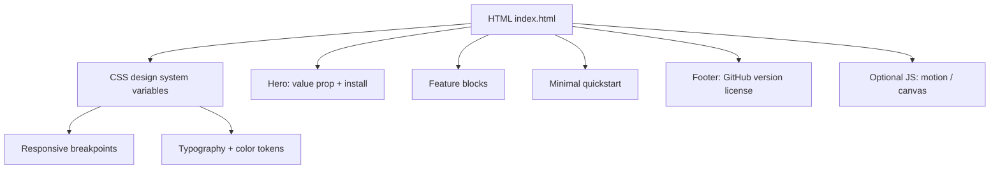

# Furnace Landing Page - Plan

**Selected options:** Light Industrial design direction, Vite static-site build, fixed-chrome centered-hero layout, lightweight canvas background/motion.

## Goal Capsule

- **Objective:** Build a single landing page for the Furnace terminal-first AI coding agent in the `furnace-site` repository. The page should communicate the product's value, key features, and install path, and should feel premium without copying the reference site.
- **Authority:** The user selects the final design direction from the options presented in this plan; implementation follows that choice.
- **Stop conditions:** The page is implemented as a single responsive landing page, loads quickly, contains hero, feature blocks, and a minimal quickstart, and matches the chosen design direction. Full documentation is out of scope.
- **Execution profile:** Standard one-off implementation, no ongoing operational infrastructure.
- **Tail ownership:** User reviews the design options and approves the final page.

---

## Product Contract

### Summary

This plan produces a single landing page for Furnace, a local-first terminal AI coding harness. The page borrows the restrained, typographic, motion-aware sensibility of [Earendil](https://earendil.com/) but reinterprets it for a developer-tool audience: sharper contrast, terminal/code motifs, and a clear install path. The design options below are explicit choices the user can make before implementation begins.

### Problem Frame

Furnace is a usable CLI (published as `cook-furnace`, invoked as `furnace`) with a rich feature set, but it has no public web presence. The repo README is thorough and developer-facing; a landing page should translate that into a concise, scannable, credible first impression for visitors who arrive via GitHub, npm, or word of mouth.

### Requirements

- R1. The page is a single landing page; it does not implement full documentation.
- R2. The hero communicates the core value proposition (terminal-first agentic coding harness) and shows the primary install command.
- R3. Feature blocks surface the most important capabilities: terminal UI, sessions/forks, tools/permissions, context compaction, skills, subagents, and plan mode.
- R4. A minimal quickstart or "first run" snippet is included so a visitor can picture using it.
- R5. The page includes a GitHub link, version badge, and license note (MIT).
- R6. The page is responsive across mobile, tablet, and desktop.
- R7. The page loads fast and avoids heavy dependencies or frameworks.
- R8. The aesthetic is influenced by Earendil but is not a direct copy; it should feel native to a terminal/code product.

### Scope Boundaries

#### In scope
- Single landing page (`index.html` plus assets).
- Hero, feature blocks, minimal quickstart, footer.
- Responsive layout and subtle motion.
- One chosen design direction from the options in this plan.

#### Deferred for later
- Full documentation site (the user explicitly deferred this).
- Blog, newsletter, changelog, or i18n.
- Dynamic backend, analytics, or CMS.
- Custom Furnace logo design (can use a wordmark or simple mark).

#### Outside this product's identity
- Marketing copy that overstates capabilities (e.g., claiming OS-level sandboxing).
- Heavy animation or WebGL that distracts from the product message.
- A framework-heavy implementation (React/Next.js/etc.) for a single static page.

### Acceptance Examples

- AE1. A visitor on a desktop browser sees the install command `npm install -g cook-furnace` within the first viewport and understands it is a CLI tool.
- AE2. A visitor on a mobile browser can scroll through the feature blocks without horizontal overflow or unreadable text.
- AE3. The page passes Lighthouse with a performance score of 90+ and no accessibility errors on the implemented version.

---

## Planning Contract

### Key Technical Decisions

The following decisions are presented as options. The user should select one option per decision before implementation begins; the implementation units assume a selection has been made.

#### KTD1. Design direction

| Option | Name | Description | Primary reference |
|---|---|---|---|
| A | **Dark Terminal** | Near-black background, warm amber or green terminal accents, generous mono typography. Feels like the TUI itself. | [Departure Mono](https://departuremono.com/) |
| B | **Light Industrial** | Warm gray background, paper-like surfaces, black ink text, industrial accent. Earendil-inspired but more technical. | [Earendil](https://earendil.com/) |
| C | **Hybrid Dark Glass** | Very dark background with subtle blue accent, glass-like surfaces, modern dev-tool feel. | [Vercel Geist](https://vercel.com/font/geist) |

**Recommendation:** Option A (Dark Terminal) because it aligns the website with the actual product experience and makes the terminal/code snippets feel native.

#### KTD2. Build approach

| Option | Name | Description | When to choose |
|---|---|---|---|
| A | **Hand-crafted static** | `index.html`, `styles.css`, `scripts.js`. No build step. | Choose for maximum simplicity and zero dependencies. |
| B | **Vite static site** | `index.html`, `src/styles.css`, `src/main.js`, `package.json` with Vite for dev server and build. | Choose if a dev server and modern CSS pipeline are worth the small Node dependency. |
| C | **Python/minijinja** | `build.py`, `_templates/index.html`, `_static/styles.css`, similar to Earendil. | Choose only if future templating or multi-page expansion is likely. |

**Recommendation:** Option A for a single landing page; Option B if the user prefers a dev-server workflow.

#### KTD3. Typography

| Role | Options | Links |
|---|---|---|
| Mono / display | Departure Mono, JetBrains Mono, Geist Mono | [Departure Mono](https://departuremono.com/), [JetBrains Mono](https://www.jetbrains.com/lp/mono/), [Geist](https://vercel.com/font/geist) |
| Sans (if used) | Inter, Geist Sans | [Inter](https://fonts.google.com/specimen/Inter), [Geist](https://vercel.com/font/geist) |
| Serif (accent only) | Plantin/Georgia fallback | System font; no external link needed |

**Recommendation:** Departure Mono for headings and terminal snippets, Inter for body text if Option A or C is chosen; Departure Mono + Georgia for Option B.

#### KTD4. Color palette

| Option | Background | Surface | Text | Muted | Accent | Palette link |
|---|---|---|---|---|---|---|
| A Dark Terminal | `#0a0a0a` | `#141414` | `#f5f5f5` | `#737373` | `#f59e0b` (amber) | [Coolors](https://coolors.co/0a0a0a-141414-f5f5f5-737373-f59e0b) |
| B Light Industrial | `#b8b8b8` | `#f4f4f0` | `#1a1a1a` | `#5a5a5a` | `#3a3a3a` | [Coolors](https://coolors.co/b8b8b8-f4f4f0-1a1a1a-5a5a5a-3a3a3a) |
| C Hybrid Dark Glass | `#050505` | `#111111` | `#e5e5e5` | `#6b7280` | `#3b82f6` | [Coolors](https://coolors.co/050505-111111-e5e5e5-6b7280-3b82f6) |

#### KTD5. Layout structure

| Option | Name | Description | Trade-off |
|---|---|---|---|
| A | **Fixed chrome, centered hero** | Fixed logo, fixed nav, fixed footer; full-screen hero with large centered statement. Borrowed from Earendil. | Premium and distinctive; less content-dense. |
| B | **Standard product landing** | Hero with terminal mockup, horizontal nav, features grid, footer. Familiar to developers. | Scannable and conventional; can feel generic. |
| C | **Asymmetric editorial** | Large type, offset feature blocks, terminal vignettes. | Unique and premium; harder to balance responsively. |

**Recommendation:** Option B with a strong typographic treatment (large hero statement, terminal snippet, asymmetric feature grid) to get both clarity and character.

#### KTD6. Background and motion

| Option | Name | Description | Trade-off |
|---|---|---|---|
| A | **Flat or gradient** | Solid background or subtle CSS gradient. No animation. | Fastest, simplest, no distraction. |
| B | **Subtle texture** | CSS noise or SVG pattern, minimal fade-in on scroll. | Adds depth without heavy code. |
| C | **Lightweight canvas** | A subtle particle field or grid that reacts to cursor, inspired by Earendil's canvas but simpler. | Premium motion; requires more code and performance care. |

**Recommendation:** Option B for the default; Option C only if the chosen direction (A or C) benefits from ambient motion.

### High-Level Technical Design

The page is a single HTML document with a small CSS design system and optional minimal JS. The layout is composed of fixed or sticky chrome (header, footer) and scrollable content sections. The hero anchors the value proposition and install command. Feature blocks follow in a vertical rhythm. Motion is limited to CSS transitions and, if chosen, a small canvas or CSS animation layer.

### Sequencing

1. Confirm design direction and build approach with the user.
2. Set up project scaffold and assets (logo/wordmark, favicon).
3. Draft final copy and section structure.
4. Build the base layout and design system (CSS variables, typography, color).
5. Implement hero, feature blocks, quickstart, and footer.
6. Add responsive behavior and chosen motion.
7. Verify performance, accessibility, and responsiveness.

### Assumptions

- The user will select one option per KTD before implementation begins.
- A custom Furnace logo is not available, so a wordmark or simple SVG mark will be used.
- The page will be hosted as static files (GitHub Pages, Vercel, or similar); no server-side logic is needed.
- The reference site (Earendil) is an aesthetic influence, not a source to clone.

---

## Implementation Units

### U1. Project scaffold and assets

- **Goal:** Create the minimal project structure and asset placeholders for the landing page.
- **Requirements:** R1, R7.
- **Dependencies:** None.
- **Files:**
  - `index.html` (created)
  - `styles.css` (created) or `src/styles.css` if Vite is chosen
  - `scripts.js` (created) or `src/main.js` if Vite is chosen
  - `assets/furnace-wordmark.svg` (created, simple wordmark)
  - `package.json` (created only if Vite is chosen)
  - `README.md` (created, site repo overview)
- **Approach:** Choose the build approach from KTD2. For Option A, the site is three files plus assets. For Option B, add Vite with a `dev` and `build` script. Keep the scaffold as small as possible.
- **Test scenarios:**
  - `index.html` opens in a browser without errors.
  - If Vite is chosen, `npm run dev` starts a local server and `npm run build` produces a static output.
- **Verification:** The site scaffold renders a blank page with no console errors.

### U2. Content and copy

- **Goal:** Finalize the landing page copy and section structure.
- **Requirements:** R2, R3, R4, R5.
- **Dependencies:** U1.
- **Files:**
  - `index.html` (modified)
- **Approach:** Write concise copy derived from the Furnace README and AGENTS.md. Sections: hero statement, install command, feature blocks (Terminal UI, Sessions & Forks, Tools & Permissions, Context Compaction, Skills, Subagents, Plan Mode), quickstart snippet, footer with GitHub link/version/license.
- **Test scenarios:**
  - All copy is accurate and does not overstate capabilities (e.g., no claim of OS sandboxing).
  - The install command is `npm install -g cook-furnace` and the CLI command is `furnace`.
- **Verification:** The user approves the copy before styling is applied.

### U3. Base layout and design system

- **Goal:** Implement the chosen design system (colors, typography, spacing) and base layout.
- **Requirements:** R6, R7, R8.
- **Dependencies:** U1, U2.
- **Files:**
  - `styles.css` or `src/styles.css` (modified)
  - `index.html` (modified)
- **Approach:** Define CSS custom properties for the chosen palette (KTD4) and typography (KTD3). Set up the chosen layout structure (KTD5). Ensure responsive breakpoints and fluid type scale. Use the selected fonts via CDN or self-hosted files.
- **Test scenarios:**
  - CSS variables are applied consistently across sections.
  - Fonts load correctly on a clean browser profile.
  - Layout is readable at 320px, 768px, and 1440px widths.
- **Verification:** The page renders the structure correctly in all target breakpoints.

### U4. Hero section

- **Goal:** Build the hero with the value proposition and install command.
- **Requirements:** R2, R8.
- **Dependencies:** U3.
- **Files:**
  - `index.html` (modified)
  - `styles.css` or `src/styles.css` (modified)
- **Approach:** A large typographic statement plus a terminal-style install block. Use the mono font for the command. Add a primary CTA ("Get started" or "View on GitHub") and a secondary link to the GitHub repo.
- **Test scenarios:**
  - The install command is selectable/copyable.
  - The hero is visually dominant on desktop and remains clear on mobile.
- **Verification:** The hero section matches the chosen design direction and the CTA links are correct.

### U5. Feature blocks

- **Goal:** Implement the feature grid or blocks for the seven key capabilities.
- **Requirements:** R3.
- **Dependencies:** U3.
- **Files:**
  - `index.html` (modified)
  - `styles.css` or `src/styles.css` (modified)
- **Approach:** Each feature block contains a short title, a one-sentence description, and a small terminal/code-style icon or snippet where appropriate. Arrange in a responsive grid (2-3 columns on desktop, 1 column on mobile). Use the mono font for feature names and the sans font for descriptions.
- **Test scenarios:**
  - All seven features are present and accurately described.
  - The grid collapses to a single column on mobile without overflow.
- **Verification:** The feature blocks match the chosen layout and typography.

### U6. Minimal quickstart

- **Goal:** Add a short quickstart section that shows how to run Furnace.
- **Requirements:** R4.
- **Dependencies:** U4.
- **Files:**
  - `index.html` (modified)
  - `styles.css` or `src/styles.css` (modified)
- **Approach:** A small terminal-style code block with the commands `furnace` and `furnace -p "Summarize this repository"`. Keep it minimal; this is not a docs page.
- **Test scenarios:**
  - The commands are correct and match the Furnace README quickstart.
  - The code block is styled consistently with the chosen direction.
- **Verification:** The quickstart is readable and accurate.

### U7. Footer

- **Goal:** Add the footer with GitHub link, version badge, and license note.
- **Requirements:** R5.
- **Dependencies:** U3.
- **Files:**
  - `index.html` (modified)
  - `styles.css` or `src/styles.css` (modified)
- **Approach:** A compact footer with a GitHub link to `https://github.com/amoreX/furnace`, the current version `0.1.2`, and the MIT license note. Use small mono type.
- **Test scenarios:**
  - The GitHub link is correct.
  - The version matches the current `package.json` in the Furnace repo.
- **Verification:** The footer renders correctly and all links work.

### U8. Responsive polish and motion

- **Goal:** Implement the chosen background/motion and finalize responsive behavior.
- **Requirements:** R6, R8.
- **Dependencies:** U4, U5, U6, U7.
- **Files:**
  - `styles.css` or `src/styles.css` (modified)
  - `scripts.js` or `src/main.js` (modified, if motion is chosen)
- **Approach:** Apply the chosen option from KTD6. For Option A, finalize flat/gradient backgrounds. For Option B, add CSS noise or SVG texture and minimal fade-in. For Option C, implement a small canvas animation. Ensure all motion respects `prefers-reduced-motion`.
- **Test scenarios:**
  - Motion is disabled when `prefers-reduced-motion: reduce` is active.
  - No layout overflow on mobile, tablet, or desktop.
- **Verification:** The page feels polished and performs well on all target sizes.

### U9. Verification and optimization

- **Goal:** Verify the page meets quality and performance standards.
- **Requirements:** R6, R7.
- **Dependencies:** U8.
- **Files:**
  - All page files.
- **Approach:** Run Lighthouse or similar checks in the browser. Test responsive breakpoints manually. Verify font loading and that no 404s exist. If Vite is used, run the build and inspect output.
- **Test scenarios:**
  - Lighthouse performance score is 90+.
  - No accessibility errors from automated checks.
  - All external links (GitHub, font CDN) are valid.
- **Verification:** The page passes the verification checks and is ready for deployment.

---

## Verification Contract

| Gate | Command / check | Expected outcome |
|---|---|---|
| Static render | Open `index.html` in a browser | Page renders with no console errors |
| Responsive | Resize to 320px, 768px, 1440px | No overflow, readable type, correct layout |
| Performance | Lighthouse performance audit | Score >= 90 |
| Accessibility | Lighthouse accessibility audit | No errors |
| Links | Click GitHub and font links | All resolve |
| Build (if Vite) | `npm run build` | Produces static output without errors |

---

## Definition of Done

- The user has selected one option per KTD and the implementation reflects those choices.
- All implementation units U1-U9 are complete.
- The page is responsive across mobile, tablet, and desktop.
- Lighthouse performance is 90+ and accessibility has no errors.
- The page accurately represents Furnace's current capabilities without overstatement.
- The design is visually related to the Earendil reference but is not a direct copy.
- The `docs/todos.md` file is updated to reflect completed planning work.

---

## Appendix: References and Links

- Furnace repo: `https://github.com/amoreX/furnace`
- Furnace npm: `https://www.npmjs.com/package/cook-furnace`
- Earendil reference site: `https://earendil.com/`
- Earendil repo: `https://github.com/earendil-works/website`
- Fonts:
  - Departure Mono: `https://departuremono.com/`
  - JetBrains Mono: `https://www.jetbrains.com/lp/mono/`
  - Inter: `https://fonts.google.com/specimen/Inter`
  - Geist: `https://vercel.com/font/geist`
- Palette tools:
  - Coolors: `https://coolors.co/`
